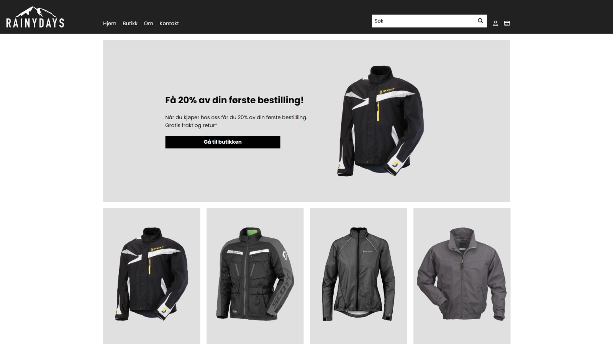

# Rainy Days 1



## Description

In this project, you will find an online shop selling men's and women's rain jackets. This was one of my first projects using HTML and CSS. I added JavaScript and fixed a few issues later due to another project.

**Note:** This is a school project and I do not intend to keep it updated. Feel free to use any inspiration from this project if you want.

## Built with

- [HTML](https://developer.mozilla.org/en-US/docs/Web/HTML)
- [CSS](https://developer.mozilla.org/en-US/docs/Web/CSS)
- [JavaScript](https://developer.mozilla.org/en-US/docs/Web/JavaScript)

## Getting started

You can find the live website on [Netlify](https://hyseh-rainy-days.netlify.app/index.html)

### Installing

Clone the repo:

```bash
git clone git@github.com:hyseh/rainy-days-1.git
```

### Running

You can use the Live Server extension to run the project locally.

## Contact

You can contact me at [john.hofland@outlook.com](mailto:john.hofland@outlook.com)
